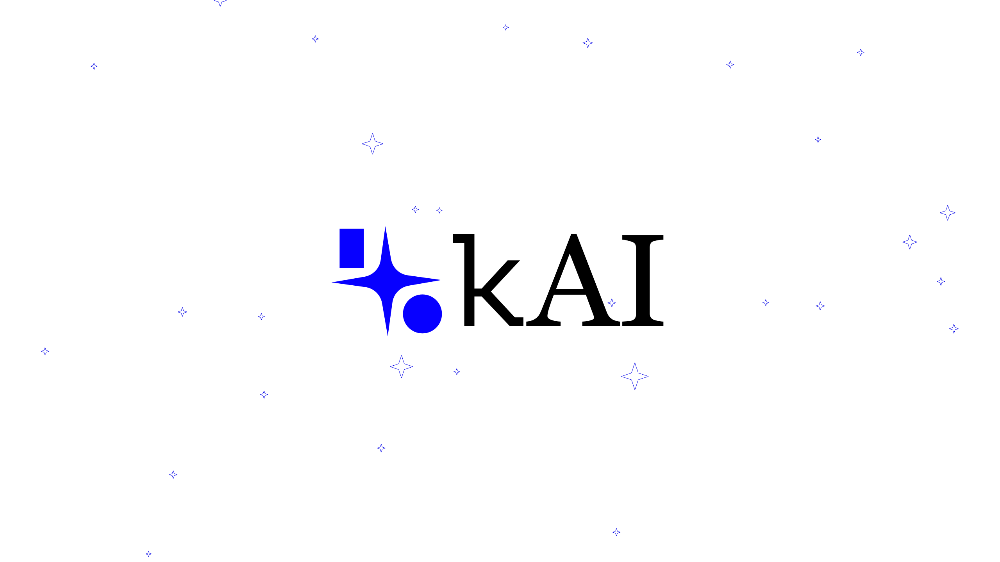

# 👋 Hello!
Welcome to the official kAI GitHub page. This is our all-in-one hub for open source activities in the AI community.

## ℹ️ About Us
kAI is an AI research & development group. We work to build better forms and better access to AI so that the advancement of human technology can continue.

Right now, we are developing an AI all-in-one toolbox platform that provides simple, streamlined, yet powerful access to tons of AI models and services. We are working to cut the clutter in the world of AI and bring everything to one centralized place, for both consumers and developers alike.

## 🔎 Where you can find us
* 🌐 **Official Website**: https://keovonteai.com
* 📰 **kAI Newsroom**: https://newsroom.keovonteai.com
* 🐦 **X**: https://x.com/keovonteai
* 💼 **LinkedIn**: https://linkedin.com/company/keovonteai
* 📷 **Instagram**: https://instagram.com/keovonteai
* 🎥 **YouTube**: https://youtube.com/@keovonteai

## ✉️ Contact Us
Here are some methods you can use to contact us:
* Tag us on social media
* Email support@keovonteai.com 

